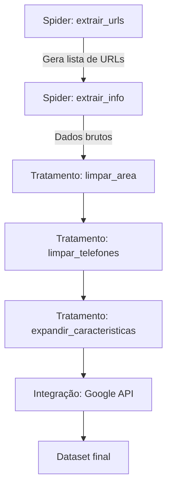

# Documentação

### Documentação do Projeto: Sistema de Raspagem e Processamento de Dados Imobiliários

---

#### **1. Visão Geral do Sistema**
O sistema coleta, processa e analisa dados de imóveis a partir do portal DF Imóveis, transformando-os em um dataset estruturado para análise. O fluxo principal consiste em:
1. Coleta de URLs de listagens
2. Extração detalhada de informações
3. Tratamento e enriquecimento dos dados
4. Integração com API externa (Google Maps)

---

#### **2. Decisões de Projeto Fundamentais**

| Decisão | Justificativa | Benefícios |
|---------|---------------|------------|
| Separação de spiders por função | Isolar responsabilidades | Manutenção mais fácil, reutilização de código |
| Processamento em etapas distintas | Permitir reprocessamento independente | Flexibilidade para ajustes pós-coleta |
| Uso de Pandas para transformações | Manipulação eficiente de dados tabulares | Performance com grandes volumes de dados |
| Modularização das funções de limpeza | Isolar lógicas específicas | Testabilidade e reutilização |
| Configuração via variáveis de ambiente | Segurança e portabilidade | Proteção de chaves API, compatibilidade multi-ambiente |

---

#### **3. Estrutura de Pastas Otimizada**

```markdown
📂 projeto_imoveis/
├── 📁 data/
│   ├── 📁 raw/          # Dados brutos da coleta
│   └── 📁 processed/    # Dados tratados
├── 📁 docs/             # Documentação
├── 📁 src/
│   ├── 📁 spiders/      # Spiders Scrapy
│   │   ├── 📄 extrair_urls.py
│   │   ├── 📄 extrair_info.py
│   │   └── 📄 __init__.py
│   ├── 📁 processing/   # Scripts de processamento
│   │   ├── 📄 processamento.py
│   │   ├── 📄 tratamento.py
│   │   └── 📄 google_api.py
│   └── 📁 utils/        # Utilitários compartilhados
├── 📄 .env              # Variáveis de ambiente
├── 📄 requirements.txt  # Dependências
└── 📄 scrapy.cfg        # Configuração Scrapy
```

---

#### **4. Principais Componentes e Fluxo**

**Fluxo Principal:**


---

#### **5. Classes e Funções Principais**

**A. Spiders (src/spiders/)**
1. `ExtrairUrlsSpider`:
   - **Responsabilidade**: Coletar URLs de imóveis paginados
   - **Métodos-chave**:
     - `start_requests()`: Inicia a navegação
     - `parse()`: Processa cada página e extrai URLs
   - **Saída**: Lista de URLs em formato JSON/TXT

2. `ExtrairInfoSpider`:
   - **Responsabilidade**: Extrair detalhes de cada imóvel
   - **Métodos-chave**:
     - `parse()`: Extrai 30+ atributos por imóvel
   - **Padrões de extração**: 
     - CSS Selectors para dados estruturados
     - Expressões regulares para dados complexos
   - **Saída**: CSV com dados brutos

---

**B. Módulo de Processamento (src/processing/)**

1. `processamento.py`:
   ```python
   def limpar_area(df, coluna: str) -> pd.DataFrame:
       """Padroniza colunas de área removendo unidades e convertendo para float"""
       # Implementação detalhada...
   
   def limpar_telefones(texto: str) -> list:
       """Extrai e padroniza números de telefone usando regex"""
   
   def expandir_caracteristicas(df, coluna: str) -> pd.DataFrame:
       """Transforma características em colunas binárias one-hot"""
   ```

2. `tratamento.py`:
   - **Função**: Orquestrar todo o pipeline de limpeza
   - **Etapas**:
     1. Carregamento de dados brutos
     2. Aplicação sequencial das funções de limpeza
     3. Conversão de tipos de dados
     4. Expansão de características

3. `google_api.py`:
   ```python
   def get_address(latitude: float, longitude: float) -> str:
       """Obtém endereço formatado a partir de coordenadas"""
       # Usa Google Maps Geocoding API
   ```

---

#### **6. Padrões de Qualidade de Dados**

| Coluna | Tipo | Transformação Aplicada |
|--------|------|------------------------|
| area_util | float | Remoção de " m²", substituição de vírgulas |
| telefone | list[str] | Extração via regex, remoção de duplicados |
| características | binary columns | One-hot encoding de features |
| total_andares_empr | float | Remoção de texto, tratamento de nulos |
| coordenadas | string | Geocodificação reversa via API |

---

#### **7. Melhores Práticas Implementadas**

1. **Resiliência na Extração**:
   - Valores default para dados ausentes
   - Tratamento de múltiplos formatos numéricos
   ```python
   .replace("Não encontrado", np.nan)
   .str.replace(" m²", "")
   ```

2. **Normalização Consistente**:
   - Padronização de unidades de medida
   - Conversão explícita de tipos de dados
   ```python
   df["quartos"] = df["quartos"].astype(int)
   ```

3. **Expansão Estruturada de Features**:
   ```python
   # Antes: "Piscina, Varanda, Garagem"
   # Depois: colunas binárias independentes
   ```

4. **Gestão de Recursos Externos**:
   - Uso de variáveis de ambiente para chaves API
   - Cache implícito em chamadas de geocodificação

---

#### **8. Instruções de Execução**

**Pipeline Completo:**
```bash
# Coletar URLs
scrapy crawl extrair_urls -o data/raw/urls.json

# Converter URLs para TXT
python utils/convert_to_txt.py

# Coletar dados dos imóveis
scrapy crawl extrair_info -o data/raw/imoveis.csv

# Processar e limpar dados
python src/processing/tratamento.py
```

**Variáveis de Ambiente:**
```ini
# .env
GOOGLE_API_KEY=your_api_key
MAX_CONCURRENT_REQUESTS=5
```

---

#### **9. Recomendações para Evolução**

1. **Implementar Testes Unitários**:
   - Validar funções de limpeza com casos extremos
   - Testar padrões regex com diferentes formatos de telefone

2. **Adicionar Monitoramento**:
   - Logging estruturado com níveis de severidade
   - Tracking de qualidade de dados (ex: % de valores nulos)

3. **Otimizar Performance**:
   - Paralelização do processamento com Pandas chunks
   - Cache de resultados da API Google

4. **Aprimorar Resiliência**:
   - Retry automático para falhas de geocodificação
   - Validação de schema dos dados extraídos

5. **Containerização**:
   ```dockerfile
   FROM python:3.10-slim
   WORKDIR /app
   COPY requirements.txt .
   RUN pip install -r requirements.txt
   COPY . .
   CMD ["python", "src/processing/tratamento.py"]
   ```

---

### Resumo Executivo
Este projeto implementa um pipeline ETL completo para dados imobiliários, destacando-se pela:
- **Arquitetura modular** com separação clara de responsabilidades
- **Robustez no tratamento** de dados semi-estruturados
- **Integração estratégica** com serviços externos
- **Escalabilidade projetada** para grandes volumes de dados

A estrutura proposta permite fácil adaptação para novos portais imobiliários e fornece bases sólidas para análises de mercado e tomada de decisão baseada em dados.